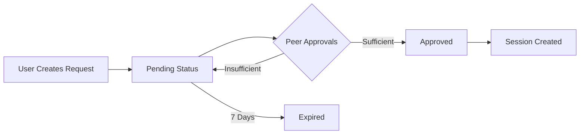

# ThyWill System Specification
## Language-Agnostic Implementation Guide

### Version: 1.0
### Last Updated: August 2025

---

## Table of Contents

1. [System Overview](#system-overview)
2. [Architecture Principles](#architecture-principles)
3. [Data Models](#data-models)
4. [API Specification](#api-specification)
5. [Authentication & Authorization](#authentication--authorization)
6. [Core Features](#core-features)
7. [Archive System](#archive-system)
8. [Configuration](#configuration)
9. [Security Requirements](#security-requirements)
10. [Implementation Guidelines](#implementation-guidelines)

---

## System Overview

### Purpose
ThyWill is a faith-focused prayer platform that facilitates community prayer support through:
- AI-generated contextual prayers
- Invite-only community structure
- Multi-device authentication system
- Archive-first data persistence
- Community accountability features

### Core Characteristics
- **Invite-Only Access**: No public registration, community-controlled growth
- **Archive-First**: Human-readable text files serve as primary data store
- **Multi-Device Support**: Peer-approval authentication system
- **Community-Focused**: Built for accountability and mutual support
- **Privacy-Conscious**: Invite trees create trust networks

### Technology Requirements
- **Web Framework**: RESTful API with server-side rendering capability
- **Database**: Relational database with transaction support
- **External APIs**: AI service integration (Claude API or equivalent)
- **File System**: Hierarchical text file storage with UTF-8 support
- **Email**: SMTP integration for verification/recovery

---

## Architecture Principles

### 1. Archive-First Design
- **Primary Principle**: All data changes must first be written to human-readable text files
- **Backup Strategy**: Text archives serve as disaster recovery mechanism
- **Data Portability**: Complete system state can be reconstructed from archives
- **Implementation**: Every database write operation must trigger corresponding archive write

### 2. Modular Service Architecture
```
Core Services:
├── Authentication Service (invite system, multi-device auth)
├── Prayer Service (AI generation, lifecycle management)
├── Archive Service (text file persistence, export/import)
├── Community Service (user management, invite trees)
├── Categorization Service (AI-powered content classification)
└── Email Service (verification, recovery, notifications)
```

### 3. Progressive Security Model
- **Level 0**: No access (unauthenticated)
- **Level 1**: Basic access (authenticated user)
- **Level 2**: Full access (fully authenticated user)
- **Level 3**: Administrative access (admin role)

### 4. Feature Flag Architecture
All new features must be controlled by feature flags with environment variable configuration:
```
FEATURE_ENABLED=true/false
FEATURE_SETTING_VALUE=configurable_value
```

---

## Data Models

### Core Entities

#### User
```yaml
Entity: User
Primary Key: display_name (string, unique)
Required Fields:
  - display_name: string (unique username)
  - created_at: timestamp
Optional Fields:
  - invited_by_username: string (referential integrity)
  - invite_token_used: string
  - is_supporter: boolean
  - supporter_type: string (financial|prayer_warrior|advisor|community_leader)
  - supporter_since: date
  - welcome_message_dismissed: boolean
  - text_file_path: string (archive location)
Indexes:
  - display_name (primary)
  - invited_by_username
  - supporter_type
```

#### Prayer
```yaml
Entity: Prayer
Primary Key: id (UUID/hex string)
Required Fields:
  - id: string (UUID hex, 32 characters)
  - text: string (original prayer request)
  - author_username: string (references User.display_name)
  - created_at: timestamp
Optional Fields:
  - generated_prayer: text (AI-generated response)
  - project_tag: string
  - safety_score: float (0.0-1.0)
  - subject_category: string
  - specificity_type: string (personal|community)
  - text_file_path: string (archive location)
Indexes:
  - author_username
  - created_at
  - safety_score
  - subject_category
```

#### Session
```yaml
Entity: Session
Primary Key: id (UUID/hex string)
Required Fields:
  - id: string (session token)
  - user_id: string (references User.display_name)
  - created_at: timestamp
  - expires_at: timestamp
  - is_fully_authenticated: boolean
Optional Fields:
  - device_info: string (user agent)
  - ip_address: string
  - auth_request_id: string (references AuthenticationRequest.id)
Constraints:
  - expires_at = created_at + 14 days
  - automatic cleanup on expiration
```

#### InviteToken
```yaml
Entity: InviteToken
Primary Key: token (string)
Required Fields:
  - token: string (UUID hex)
  - created_by_user: string
  - expires_at: timestamp
  - token_type: string (invite|user_login|email_verification|multi_device)
Optional Fields:
  - max_uses: integer (null = unlimited)
  - usage_count: integer (default: 0)
  - used_by_user_id: string
Business Rules:
  - token_type determines usage pattern
  - max_uses controls token lifecycle
  - expires_at enforced on all operations
```

#### AuthenticationRequest
```yaml
Entity: AuthenticationRequest
Primary Key: id (UUID/hex string)
Required Fields:
  - id: string
  - user_id: string (references User.display_name)
  - created_at: timestamp
  - expires_at: timestamp (created_at + 7 days)
  - status: string (pending|approved|rejected|expired)
Optional Fields:
  - device_info: string
  - ip_address: string
  - verification_code: string (6-digit)
  - approved_by_user_id: string
  - approved_at: timestamp
Business Rules:
  - Requires configurable number of peer approvals
  - Automatic expiration after 7 days
  - Rate limited per user/IP
```

#### PrayerAttribute
```yaml
Entity: PrayerAttribute
Purpose: Extensible prayer state management
Required Fields:
  - prayer_id: string (references Prayer.id)
  - attribute_name: string
  - attribute_value: string
  - created_by_user: string
  - created_at: timestamp
Unique Constraint: (prayer_id, attribute_name)
Common Attributes:
  - archived: "true"|"false"
  - answered: "true"|"false"
  - flagged: "true"|"false"
```

### Relationships

#### Community Structure
```
InviteToken → User (via invite_token_used)
User → InviteToken (created_by_user)
User → AuthenticationRequest (user_id)
AuthenticationRequest → AuthApproval (auth_request_id)
```

#### Prayer Interactions
```
User → Prayer (author_username)
User + Prayer → PrayerMark (prayer engagement)
Prayer → PrayerAttribute (extensible metadata)
```

#### Role-Based Access
```
Role ← UserRole → User
UserRole.expires_at (optional expiration)
Role.permissions (JSON array)
```

---

## API Specification

### Authentication Endpoints

#### Registration Flow
```http
GET /claim/{token}
- Purpose: Display invite claim form
- Response: HTML form or redirect if logged in
- Validation: Token exists, not expired, usage limits

POST /claim/{token}
- Purpose: Complete account registration
- Body: { display_name: string }
- Response: Redirect to main feed or auth status
- Side Effects: Create User, Session, update InviteToken
```

#### Login Flow
```http
GET /login
- Purpose: Display login form
- Response: HTML form with community auth request

POST /login
- Purpose: Create authentication request
- Body: { username: string }
- Response: Redirect to auth status page
- Side Effects: Create AuthenticationRequest
```

#### Multi-Device Authentication
```http
GET /auth/status
- Purpose: Show authentication request status
- Auth Required: Half-authenticated session
- Response: HTML with approval progress

POST /auth/approve/{request_id}
- Purpose: Approve authentication request
- Auth Required: Fully authenticated
- Body: Optional approval data
- Side Effects: Create AuthApproval, possibly approve request
```

### Prayer Management Endpoints

#### Core Prayer Operations
```http
GET /
- Purpose: Display prayer feed
- Query Parameters:
  - feed: all|new_unprayed|most_prayed|my_prayers|my_unprayed
  - category: health|work|family|relationships|other
  - safety: high_safety_only (if enabled)
- Response: HTML with prayer cards

POST /prayers
- Purpose: Submit new prayer request
- Auth Required: Authenticated
- Body: { text: string, project_tag?: string }
- Response: Redirect to feed or prayer detail
- Side Effects: Create Prayer, generate AI response, create archive entry
```

#### Prayer Status Management
```http
POST /prayer/{id}/archive
- Purpose: Archive prayer request
- Auth Required: Author or admin
- Side Effects: Set PrayerAttribute.archived = "true"

POST /prayer/{id}/answered
- Purpose: Mark prayer as answered
- Auth Required: Author
- Side Effects: Set PrayerAttribute.answered = "true"

POST /mark/{id}
- Purpose: Mark that you prayed for this request
- Auth Required: Authenticated
- Side Effects: Create/update PrayerMark
```

### Administrative Endpoints

#### User Management
```http
GET /admin/users
- Purpose: List all users with management controls
- Auth Required: Admin role
- Response: HTML with user grid

POST /admin/users/{user_id}/grant-admin
- Purpose: Promote user to admin
- Auth Required: Admin role
- Side Effects: Create UserRole with admin role
```

#### Content Moderation
```http
POST /flag/{prayer_id}
- Purpose: Flag inappropriate content
- Auth Required: Authenticated
- Side Effects: Set PrayerAttribute.flagged = "true"
```

### Archive & Export Endpoints

#### Individual Archives
```http
GET /api/archive/user/{user_id}/download
- Purpose: Export user's complete archive
- Auth Required: Self or admin
- Response: ZIP file with text archives
- Content: All prayers, activity, attributes for user
```

#### Community Export
```http
GET /api/archive/community/download
- Purpose: Export complete community archive
- Auth Required: Admin role
- Response: ZIP file with all text archives
- Content: Full community data dump
```

---

## Authentication & Authorization

### Invite-Only Registration System

#### Token Types
```yaml
invite:
  - Purpose: New user registration
  - Lifecycle: Single use or limited count
  - Creator: Admin or existing user
  - Expiration: Configurable (default: 7 days)

user_login:
  - Purpose: Direct login bypass
  - Lifecycle: Single use
  - Creator: System (password reset, device auth)
  - Expiration: 1 hour

email_verification:
  - Purpose: Email address verification
  - Lifecycle: Single use
  - Creator: System
  - Expiration: 24 hours

multi_device:
  - Purpose: Device authorization
  - Lifecycle: Single use
  - Creator: User (self-authorization)
  - Expiration: 7 days
```

#### Registration Process
1. **Admin/User Creates Invite**: Generate token with usage constraints
2. **Invite Distribution**: Token shared via secure channel
3. **User Claims Token**: Access `/claim/{token}` endpoint
4. **Username Selection**: Must be unique across system
5. **Account Creation**: User record created with invite tracking
6. **Immediate Authentication**: Session created for new user

### Multi-Device Authentication

#### Authentication Request Lifecycle


#### Approval Requirements
- **Peer Count**: Configurable via `PEER_APPROVAL_COUNT` (default: 2)
- **Approver Eligibility**: Fully authenticated users
- **Self-Approval**: Not permitted
- **Admin Override**: Admin approval counts as sufficient

#### Security Measures
- **Rate Limiting**: 3 requests per hour per user/IP
- **Device Fingerprinting**: User agent tracking
- **IP Validation**: Geographic consistency checks
- **Verification Codes**: 6-digit codes for additional verification

### Session Management

#### Session Lifecycle
- **Creation**: On successful authentication
- **Duration**: 14 days from creation
- **Renewal**: Automatic on activity
- **Termination**: Manual logout or expiration

#### Authentication Levels
```yaml
Unauthenticated:
  - Access: Public pages only (/how-it-works, /health)
  - Restrictions: No prayer access, no community features

Authenticated:
  - Access: Prayer feeds, submission, marking
  - Restrictions: Limited device creation, no admin functions

Fully Authenticated:
  - Access: Device token creation, sensitive operations
  - Requirements: Peer-approved or admin-granted

Admin:
  - Access: All system functions
  - Requirements: Admin role assignment
```

---

## Core Features

### Prayer System

#### AI-Generated Prayers
```yaml
Implementation Requirements:
  - External AI Service: Claude API or equivalent
  - Input Processing: Clean and validate prayer request text
  - Prompt Engineering: Context-aware prayer generation
  - Response Handling: Store generated prayer with original
  - Error Handling: Graceful degradation if AI unavailable
  - Rate Limiting: Prevent API abuse

Prompt Structure:
  - System Context: Faith-focused, supportive tone
  - User Request: Original prayer text
  - Community Guidelines: Appropriate content boundaries
  - Response Format: Formatted prayer text
```

#### Prayer Feeds
```yaml
Feed Types:
  all: All active prayers, newest first
  new_unprayed: Unprayed requests, oldest first
  most_prayed: Highest prayer mark count
  my_prayers: User's submitted requests
  my_unprayed: User's unprayed requests
  
Filtering Options:
  - Category: health, work, family, relationships, other
  - Safety Level: high_safety_only filter
  - Date Range: configurable time windows
  - Author: specific user prayers
  
Implementation:
  - Database queries with appropriate indexes
  - Pagination for performance
  - Real-time updates via HTMX or similar
```

#### Prayer Categorization
```yaml
AI-Powered Classification:
  - Safety Scoring: 0.0-1.0 scale for content appropriateness
  - Subject Categories: health|work|family|relationships|other
  - Specificity Types: personal|community
  
Feature Flags (18 total):
  - PRAYER_CATEGORIZATION_ENABLED
  - AI_CATEGORIZATION_ENABLED
  - KEYWORD_FALLBACK_ENABLED
  - PRAYER_CATEGORY_BADGES_ENABLED
  - PRAYER_CATEGORY_FILTERING_ENABLED
  - SAFETY_SCORING_ENABLED
  - HIGH_SAFETY_FILTER_ENABLED
  - SPECIFICITY_BADGES_ENABLED
```

### Community Features

#### Supporter Badge System
```yaml
Badge Types:
  financial:
    symbol: "♥"
    color: "#dc2626"
    tooltip: "Financial Supporter"
    priority: 1
  
  prayer_warrior:
    symbol: "🙏"
    color: "#8b5cf6"
    tooltip: "Prayer Warrior"
    priority: 2
  
  advisor:
    symbol: "🌟"
    color: "#f59e0b"
    tooltip: "Community Advisor"
    priority: 3
  
  community_leader:
    symbol: "🤝"
    color: "#10b981"
    tooltip: "Community Leader"
    priority: 4

Implementation:
  - Multi-type support (comma-separated)
  - Priority ordering for display
  - Maximum 3 badges to avoid UI clutter
  - Template filter for consistent rendering
```

#### Content Moderation
```yaml
Community Flagging:
  - Any authenticated user can flag content
  - Flagged content marked for admin review
  - Multiple flags escalate priority
  - Administrative override capabilities

Automated Moderation:
  - AI safety scoring for prayer content
  - Configurable safety thresholds
  - Automatic quarantine for low scores
  - Human review queue for borderline content
```

### Invite Tree System
```yaml
Hierarchical Structure:
  - Each user tracks their inviter
  - Invitation limits per user level
  - Administrative override capabilities
  - Community growth tracking

Implementation:
  - invited_by_username field in User table
  - invite_token_used for traceability
  - Recursive queries for tree visualization
  - Analytics for invitation effectiveness
```

---

## Archive System

### Philosophy
The archive system is ThyWill's unique architectural innovation, treating human-readable text files as the primary data store with the database serving as a performance cache.

### Directory Structure
```
text_archives/
├── prayers/
│   └── {year}/
│       └── {month}/
│           ├── prayers_{year}_{month}.txt
│           └── activity_{year}_{month}.txt
├── users/
│   ├── user_attributes.txt
│   └── {username}/
│       ├── prayers.txt
│       ├── activity.txt
│       └── metadata.txt
└── system/
    ├── invites.txt
    ├── sessions.txt
    └── admin_actions.txt
```

### File Formats

#### Prayer Archive Format
```
=== Prayer ID: abc123def456 ===
Author: username
Created: 2025-08-08 14:30:00 UTC
Project Tag: personal

Original Request:
[Prayer request text here]

Generated Prayer:
[AI-generated prayer response]

Attributes:
- archived: false
- answered: false
- flagged: false

=== End Prayer ===
```

#### Activity Log Format
```
[2025-08-08 14:30:00] USER:username ACTION:prayer_submitted PRAYER:abc123def456 IP:192.168.1.1
[2025-08-08 14:31:15] USER:otheruser ACTION:prayer_marked PRAYER:abc123def456 IP:192.168.1.2
[2025-08-08 14:32:00] USER:username ACTION:prayer_archived PRAYER:abc123def456 IP:192.168.1.1
```

#### User Attributes Format
```
username: John Smith
is_supporter: true
supporter_type: financial,prayer_warrior
supporter_since: 2025-07-15
welcome_message_dismissed: true

username: Jane Doe
is_supporter: false
supporter_type: 
supporter_since: 
welcome_message_dismissed: false
```

### Archive Operations

#### Core Principles
- **Write-Through**: All database changes immediately reflected in archives
- **Idempotent**: Safe to run import/export operations multiple times
- **Complete**: Archives contain all information needed for full reconstruction
- **Human-Readable**: UTF-8 text files with consistent formatting

#### Key Operations
```yaml
export_all:
  - Purpose: Create complete archive snapshot
  - Output: ZIP file with all text archives
  - Timing: Pre-deployment, backup operations
  - Content: All users, prayers, activity, system data

import_all:
  - Purpose: Reconstruct database from archives
  - Input: text_archives/ directory structure
  - Safety: Duplicate detection, conflict resolution
  - Verification: Content validation, relationship integrity

heal_archives:
  - Purpose: Create missing archive entries
  - Process: Scan database, create corresponding text files
  - Content: Complete activity history, chronological order
  - Verification: Round-trip compatibility testing
```

---

## Configuration

### Environment Variables

#### Core System
```yaml
# Database
DATABASE_URL: string (default: sqlite:///thywill.db)
AUTO_MIGRATE_ON_STARTUP: boolean (default: false, production: true)

# Server
PORT: integer (default: 8000)
DEBUG: boolean (default: false)

# Security
JWT_SECRET: string (required for sessions)
RATE_LIMIT_PER_HOUR: integer (default: 3)
SESSION_EXPIRE_DAYS: integer (default: 14)

# Authentication
MULTI_DEVICE_AUTH_ENABLED: boolean (default: true)
PEER_APPROVAL_COUNT: integer (default: 2)
REQUIRE_VERIFICATION_CODE: boolean (default: false)
DEFAULT_INVITE_MAX_USES: integer (default: 1)
```

#### AI Integration
```yaml
# Claude API
ANTHROPIC_API_KEY: string (required for AI features)
AI_MODEL: string (default: claude-3-sonnet)
AI_MAX_TOKENS: integer (default: 1000)
AI_TEMPERATURE: float (default: 0.7)
```

#### Email System
```yaml
EMAIL_AUTH_ENABLED: boolean (default: false)
SMTP_HOST: string
SMTP_PORT: integer (default: 587)
SMTP_USER: string
SMTP_PASSWORD: string
SMTP_FROM: string
EMAIL_ENCRYPTION_KEY: string (base64 encoded)
```

#### Prayer Categorization
```yaml
PRAYER_CATEGORIZATION_ENABLED: boolean (default: false)
AI_CATEGORIZATION_ENABLED: boolean (default: false)
KEYWORD_FALLBACK_ENABLED: boolean (default: false)
SAFETY_SCORING_ENABLED: boolean (default: false)
HIGH_SAFETY_FILTER_ENABLED: boolean (default: false)
PRAYER_CATEGORY_BADGES_ENABLED: boolean (default: false)
PRAYER_CATEGORY_FILTERING_ENABLED: boolean (default: false)
SPECIFICITY_BADGES_ENABLED: boolean (default: false)
```

#### Archive System
```yaml
TEXT_ARCHIVE_ENABLED: boolean (default: true)
ARCHIVE_COMPRESSION: boolean (default: true)
ARCHIVE_RETENTION_DAYS: integer (default: 365)
AUTO_ARCHIVE_CLEANUP: boolean (default: false)
```

### Feature Flag Guidelines

#### Implementation Pattern
```yaml
1. Environment Variable: FEATURE_NAME_ENABLED=true/false
2. Service Check: if (!isFeatureEnabled('FEATURE_NAME')) return disabled_response
3. UI Conditional:  ... 
4. Graceful Degradation: Feature disabled should not break core functionality
```

#### Rollout Strategy
```yaml
Development: All flags enabled for testing
Staging: Production configuration for final validation  
Production: Gradual enablement based on system capacity
```

---

## Security Requirements

### Input Validation
```yaml
Prayer Text:
  - Maximum Length: 5000 characters
  - Content Filtering: Basic profanity, spam detection
  - XSS Prevention: HTML entity encoding
  - SQL Injection: Parameterized queries

Username Validation:
  - Format: Alphanumeric, spaces, hyphens, underscores
  - Length: 3-40 characters
  - Uniqueness: Case-insensitive checking
  - Reserved Names: System usernames blocked

Email Validation:
  - Format: RFC 5322 compliance
  - Domain: MX record validation optional
  - Uniqueness: One email per user
  - Encryption: AES encryption for storage
```

### Rate Limiting
```yaml
Authentication Requests:
  - Limit: 3 per hour per user
  - Scope: IP address + username
  - Punishment: Exponential backoff
  - Bypass: Administrative override

Prayer Submissions:
  - Limit: 10 per hour per user
  - Scope: Authenticated user
  - Punishment: Temporary suspension
  - Bypass: Trusted user designation

API Endpoints:
  - General: 100 requests per hour per IP
  - Authentication: 10 requests per hour per IP
  - Admin: 1000 requests per hour (authenticated)
```

### Data Protection
```yaml
Session Security:
  - HTTP-Only Cookies: Prevent XSS access
  - Secure Flag: HTTPS-only transmission
  - SameSite: CSRF protection
  - Expiration: Automatic cleanup

Sensitive Data:
  - Email Addresses: AES encryption
  - IP Addresses: Hashed for privacy
  - Device Info: Anonymized fingerprints
  - Prayer Content: Plain text (community feature)

Audit Logging:
  - All Authentication Events: Success/failure
  - Administrative Actions: User management
  - Content Moderation: Flagging, removal
  - Data Export: Archive downloads
```

### Content Security
```yaml
AI Safety Scoring:
  - Scale: 0.0 (unsafe) to 1.0 (safe)
  - Threshold: Configurable minimum score
  - Review Queue: Manual review for borderline content
  - Override: Administrative content approval

Community Moderation:
  - Flagging System: User-reported content
  - Escalation: Multiple flags trigger review
  - Administrative Tools: Content removal, user warnings
  - Appeal Process: User content appeal system
```

---

## Implementation Guidelines

### Technology Stack Requirements

#### Backend Framework
```yaml
Required Capabilities:
  - RESTful API development
  - Server-side HTML rendering
  - WebSocket/SSE support (optional, for real-time updates)
  - Database ORM/query builder
  - Session management
  - File upload/download handling

Recommended Patterns:
  - MVC or similar architectural pattern
  - Dependency injection for services
  - Middleware pipeline for authentication
  - Background job processing for AI calls
```

#### Database Requirements
```yaml
Required Features:
  - ACID transactions
  - Foreign key constraints
  - Index support
  - Full-text search capability
  - JSON field support (for permissions, metadata)
  - Connection pooling

Schema Migration:
  - Version-controlled schema changes
  - Up/down migration support
  - Automatic migration on deployment
  - Rollback capabilities
```

#### Frontend Approach
```yaml
Server-Side Rendering:
  - Template engine with inheritance
  - Component/partial support
  - Form handling and validation
  - CSRF protection
  - Progressive enhancement

Optional Enhancements:
  - HTMX or similar for dynamic updates
  - Basic JavaScript for UX improvements
  - Mobile-responsive CSS framework
  - Dark mode support
```

### Development Practices

#### Code Organization
```yaml
Service Layer Pattern:
  - Business logic in dedicated service classes
  - Database operations abstracted behind repositories
  - External API calls in separate service modules
  - Configuration management centralized

Testing Strategy:
  - Unit tests for business logic
  - Integration tests for database operations
  - API tests for endpoint contracts
  - End-to-end tests for critical user flows

Documentation:
  - API documentation (OpenAPI/Swagger)
  - Database schema documentation
  - Feature flag documentation
  - Deployment procedures
```

#### Error Handling
```yaml
User-Facing Errors:
  - Friendly error messages
  - Graceful degradation
  - Retry mechanisms for transient failures
  - Contact information for support

System Errors:
  - Comprehensive logging
  - Error tracking integration
  - Performance monitoring
  - Alerting for critical failures

Data Integrity:
  - Transaction boundaries
  - Concurrent access handling
  - Backup verification
  - Archive consistency checks
```

### Deployment Considerations

#### Infrastructure Requirements
```yaml
Minimum Resources:
  - CPU: 1 core (2+ recommended)
  - RAM: 1GB (2GB+ recommended)
  - Storage: 10GB (for archives)
  - Network: Standard web hosting

Database:
  - SQLite: Suitable for small communities (<1000 users)
  - PostgreSQL/MySQL: Recommended for larger deployments
  - Backup Strategy: Daily automated backups
  - Archive Storage: Separate volume recommended

External Dependencies:
  - AI Service: Claude API or compatible
  - Email Service: SMTP server
  - File Storage: Local filesystem or cloud storage
  - Monitoring: Application performance monitoring
```

#### Scaling Considerations
```yaml
Performance Bottlenecks:
  - AI API calls: Implement caching and queuing
  - Archive operations: Background processing
  - Database queries: Proper indexing and optimization
  - File operations: Efficient I/O handling

Horizontal Scaling:
  - Stateless application design
  - Database connection pooling
  - Load balancer session affinity
  - Shared file system for archives

Monitoring:
  - Application health endpoints
  - Database performance metrics
  - Archive integrity verification
  - User activity analytics
```

### Migration Strategy

#### From Existing Systems
```yaml
Data Migration:
  - User account import utilities
  - Prayer content migration scripts
  - Archive reconstruction from existing data
  - Permission and role mapping

Gradual Rollout:
  - Feature flag controlled deployment
  - A/B testing for new features
  - User training and documentation
  - Feedback collection and iteration

Rollback Planning:
  - Database backup before migration
  - Feature flag emergency disable
  - Quick rollback procedures
  - Data export capabilities
```

---

## Conclusion

This specification provides a comprehensive foundation for reimplementing ThyWill in any technology stack while maintaining its core architectural principles and community-focused features. The key to successful implementation lies in:

1. **Preserving the Archive-First Philosophy**: Text files as source of truth
2. **Maintaining Community Accountability**: Invite-only, peer-approval systems
3. **Ensuring Data Portability**: Complete system reconstruction capability
4. **Implementing Progressive Security**: Layered authentication and authorization
5. **Supporting Feature Evolution**: Comprehensive feature flag architecture

The modular service architecture allows for gradual implementation and testing of individual components, while the comprehensive configuration system enables deployment flexibility across different environments and community sizes.

---

## Appendix: Implementation Checklist

### Phase 1: Core Infrastructure
- [ ] Database schema implementation
- [ ] User authentication system
- [ ] Session management
- [ ] Basic prayer CRUD operations
- [ ] Archive system foundation

### Phase 2: Community Features
- [ ] Invite token system
- [ ] Multi-device authentication
- [ ] Prayer feed implementations
- [ ] Basic moderation features
- [ ] Archive import/export

### Phase 3: Advanced Features
- [ ] AI prayer generation
- [ ] Prayer categorization system
- [ ] Email integration
- [ ] Supporter badge system
- [ ] Administrative interfaces

### Phase 4: Production Readiness
- [ ] Comprehensive testing suite
- [ ] Performance optimization
- [ ] Security hardening
- [ ] Monitoring and alerting
- [ ] Documentation completion

This specification serves as a living document that should be updated as the system evolves and new requirements emerge from community usage patterns and feedback.